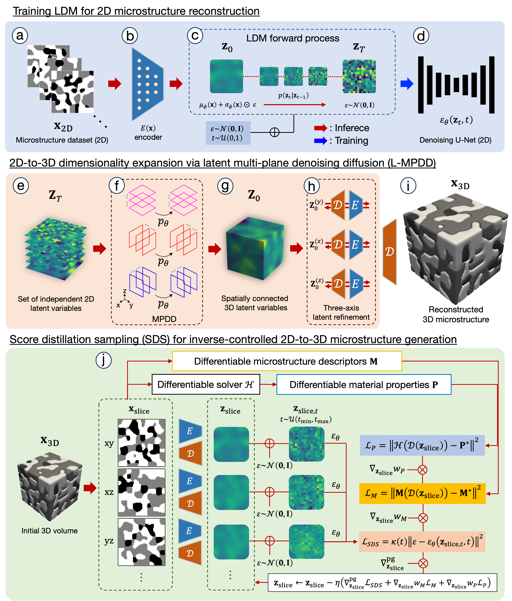

# MicroLad (updated)



2D‑to‑3D Microstructure Reconstruction/Generation


## Quick Start

### Using Pre-trained Weights (Recommended)

```python
# Download from Hugging Face
from huggingface_hub import hf_hub_download

vae = hf_hub_download('kanghl/microlad-anode', 'vae_anode.pth')
unet = hf_hub_download('kanghl/microlad-anode', 'unet_anode.pth')
tpc = hf_hub_download('kanghl/microlad-anode', 'autocorr_periodic_mean_std.npz')

# Generate 3D volumes
import subprocess
subprocess.run([
    'python', 'generate.py',
    '--vae_ckpt', vae,
    '--unet_ckpt', unet,
    '--training_tpc', tpc,
    '--save_dir', './output',
    '--n_volumes', '10'
])
```

```bash
# Generate
python generate.py \
    --vae_ckpt ./pretrained/vae_anode.pth \
    --unet_ckpt ./pretrained/unet_anode.pth \
    --training_tpc ./pretrained/autocorr_periodic_mean_std.npz \
    --save_dir ./output \
    --vf_targets "0:0.35,0.5:0.28,1:0.37" \
    --n_volumes 10
```

## Complete Workflow

### 1. Compute Training Statistics

```bash
python compute_training_statistics.py \
    ./training_images \
    ./training_stats
```

**Output:** `autocorr_periodic_mean_std.npz` with TPC targets

### 2. Train VAE

```bash
python train_vae.py \
    --data_dir ./training_images \
    --save_dir ./vae_checkpoints \
    --epochs 100
```

**Output:** `vae_epoch100.pth`

### 3. Train Latent Diffusion Model

```bash
python train_ldm.py \
    --data_dir ./training_images \
    --vae_ckpt ./vae_checkpoints/vae_epoch100.pth \
    --save_dir ./ldm_checkpoints \
    --epochs 200
```

**Output:** `unet_ep200.pth`

### 4. Generate 3D Volumes

```bash
python generate.py \
    --vae_ckpt ./vae_checkpoints/vae_epoch100.pth \
    --unet_ckpt ./ldm_checkpoints/unet_ep200.pth \
    --training_tpc ./training_stats/autocorr_periodic_mean_std.npz \
    --save_dir ./output \
    --vf_targets "0:0.35,0.5:0.28,1:0.37" \
    --n_volumes 10
```